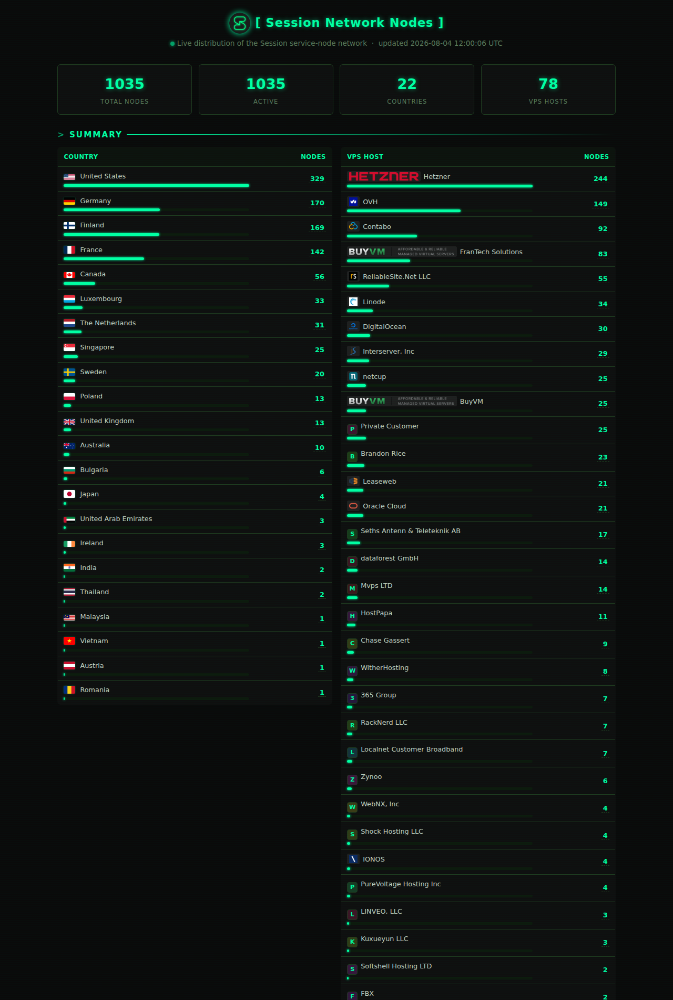

# Session Network Nodes

Live dashboard of the **Session service-node network**: where nodes run, on which VPS providers, and who operates them.



## Features

- **Summary tables** - total nodes / active / countries / VPS hosts, with per-country and per-host counts and distribution bars
- **Click a count to filter** - click a country or host count to jump to the nodes table with that filter applied
- **Live node list** - every node with country flag, IP address, region/city, VPS host, operator wallet, fee %, version, swarm, last uptime proof
- **Search** - filter nodes by IP, country, host, city, region, operator wallet, or public key
- **Sortable columns** - click any column header to sort
- **Click-to-copy** - click an IP or truncated operator wallet to copy the full value
- **Live data** - refreshes hourly server-side, auto-reloads in the browser every 2 minutes
- **Self-hosted assets** - all country flags and VPS host logos are served first-party, zero third-party requests

## How it works

```
observer.getsession.org (node list + per-node details)
        │
        ▼
update_nodes.py  ── ip-api.com batch (geo + VPS host per IP)
        │
        ▼
nodes.json  ── index.html (static page, renders client-side)
```

1. **`update_nodes.py`** (hourly cron): scrapes the observer node list, pulls each node's detail page (`/sn/<pubkey>/1`) for its IP and metadata, geo-enriches unique IPs via `ip-api.com/batch`, and writes `nodes.json`
2. **`index.html`**: a static page that fetches `nodes.json` and renders the dashboard - no server-side rendering needed
3. **nginx**: serve the folder, with `no-store` on `nodes.json` so data is always fresh

## Setup

```bash
# 1. Run the scraper (writes nodes.json)
python3 update_nodes.py

# 2. Serve the folder, e.g. under nginx at /secret
#    location /secret/ { try_files $uri $uri/ =404; expires -1; add_header Cache-Control "no-store"; }

# 3. Keep it live (hourly cron)
#    0 * * * * python3 /path/to/update_nodes.py
```

The scraper caches node details and geo lookups (`cache.json`, `geo.json`), so re-runs only fetch new/changed nodes and IPs. The first run takes ~1-2 minutes for the full network (~1000 nodes); subsequent runs are near-instant.

## Data sources

- **Node data**: [observer.getsession.org](https://observer.getsession.org/service_nodes)
- **Geo / VPS host**: [ip-api.com](http://ip-api.com) (batch endpoint)
- **Flags**: [flagcdn.com](https://flagcdn.com)
- **Logos**: provider brand assets (Hetzner, OVH, Contabo, DigitalOcean, Linode, and more)

## Requirements

- Python 3.11+ (stdlib only - no pip dependencies)
- Any static file server for the page

## License

MIT
